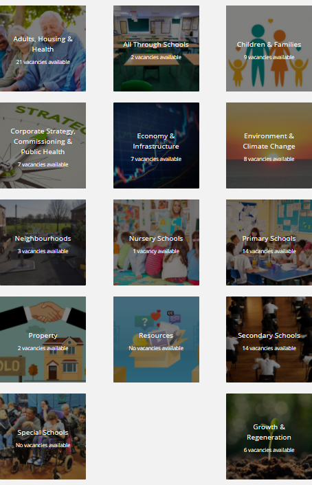
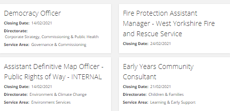

# Oleeo React Components

This project exposes components for use on Oleeo Careers Sites.

## Usage

These components all require React and ReactDOM scripts to be added to the `<head>` of all Webflow pages which use the components. This can be added using:

```html
<script
  src="https://unpkg.com/react@17/umd/react.production.min.js"
  crossorigin
></script>
<script
  src="https://unpkg.com/react-dom@17/umd/react-dom.production.min.js"
  crossorigin
></script>
```

**Note**: only version 17 of React and ReactDOM have been tested.

All components have been assigned to the `window.oleeo` object and can be accessed from there.

E.g. for the HomepageTiles component:

```javascript
window.oleeo.HomepageTiles;
```

### HomepageTiles Component

This component renders a "tile" for each job category passed as props, including a background image and a count of how many jobs are available in each category.



#### Basic Usage

```html
<div id="homepage-vacancy-tiles"></div>
<script>
  window.addEventListener('load', function () {
    ReactDOM.render(
      React.createElement(window.oleeo.HomepageTiles, {
        feedURL:
          'https://kirklees.tal.net/vx/mobile-0/appcentre-1/brand-4/candidate/jobboard/vacancy/4/feed/structured',
        tiles: directorates,
        countField: 'directorate',
      }),
      document.getElementById('homepage-vacancy-tiles')
    );
  });
</script>
```

#### Params

| **Name**   | **Description**                                                                                                                                                                           |
| ---------- | ----------------------------------------------------------------------------------------------------------------------------------------------------------------------------------------- |
| feedURL    | The URL of the structured RSS Feed from which jobs can be pulled.                                                                                                                         |
| tiles      | An array of objects which contain the information required for the tile. It should contain the name, slug and imageURL of the job category and can be created using a Webflow collection. |
| countField | The key of the field to match in the RSS feed and count the number of vacancies per category.                                                                                             |

### HomepageListing Component

This component renders a "card" for each job available. Includes configurable properties to display. The component opens a modal with the vacancy description when clicked.



#### Basic Usage

```html
<div id="homepage-vacancy-listing"></div>
<script>
  window.onload = function () {
    ReactDOM.render(
      React.createElement(window.oleeo.VacancyListing, {
        feedURL:
          'https://kirklees.tal.net/vx/mobile-0/appcentre-1/brand-4/candidate/jobboard/vacancy/4/feed/structured',
        numberOfItems: 4,
        propertiesToDisplay: [
          {
            key: 'directorate',
            label: 'Directorate: ',
            isArray: false,
            isHTML: true,
          },
          {
            key: 'service_area',
            label: 'Service Area: ',
            isArray: false,
            isHTML: true,
          },
        ],
        modalPropertiesToDisplay: [
          {
            key: 'service_area',
            label: 'Service Area',
            isArray: false,
            isHTML: true,
          },
          {
            key: 'directorate',
            label: 'Directorate',
            isArray: false,
            isHTML: true,
          },
          {
            key: 'position_type',
            label: 'Position Type',
            isArray: false,
            isHTML: false,
          },
        ],
        filter: function () {
          return true;
        },
      }),
      document.getElementById('homepage-vacancy-listing')
    );
  };
</script>
```

#### Params

| **Name**                 | **Description**                                                                                          |
| ------------------------ | -------------------------------------------------------------------------------------------------------- |
| feedURL                  | The URL of the structured RSS Feed from which jobs can be pulled.                                        |
| numberOfItems            | The maximum number of items to display                                                                   |
| propertiesToDisplay      | An array of objects detailing which vacancy properties are displayed on the card. See below for schema.  |
| modalPropertiesToDisplay | An array of objects detailing which vacancy properties are displayed in the modal. See below for schema. |
| filter                   | A JavaScript function to filter the records.                                                             |

#### Schema

| **Item** | **Type** | **Description**                                                                                                            |
| -------- | -------- | -------------------------------------------------------------------------------------------------------------------------- |
| key      | string   | The key for the item in the RSS feed. The component will look inside the content tag to find this item.                    |
| label    | string   | The label to display before the value.                                                                                     |
| isArray  | boolean  | Whether or not the item is an Array. If it is, it automatically includes each item in a comma separated list.              |
| isHTML   | boolean  | Whether or not the item contains raw HTML. This should be used with caution as it allows the content to be rendered as is. |

### Search

A component to display a search bar in which a user can search for vacancies or vacancy categories.

**Note**: This component is still a work in progress and is not yet ready for production.

#### Basic Usage

```html
<div id="homepage-vacancy-search"></div>
<script>
  console.log(directorates);
  window.addEventListener('load', () => {
    ReactDOM.render(
      React.createElement(window.oleeo.Search, {
        feedURL:
          'https://kirklees.tal.net/vx/mobile-0/appcentre-1/brand-4/candidate/jobboard/vacancy/4/feed/structured',
        categories: directorates,
      }),
      document.getElementById('homepage-vacancy-search')
    );
  });
</script>
```

## Cross Browser Compatibility

The project is configured to include polyfills so that it works on older versions of IE.

## Accessibility

The components have been created to be fully compliant with Web Content Accessibility Guidelines (WCAG) level AA.

## Key Contacts

Rob Bailey - robert.bailey@oleeo.com
Siva Mayuran - sivalingham.mayuran@oleeo.com
